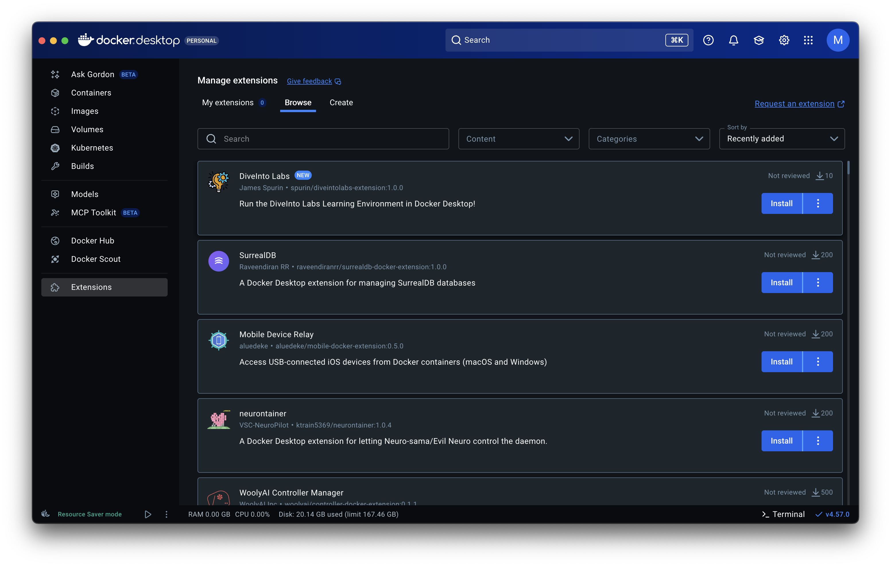
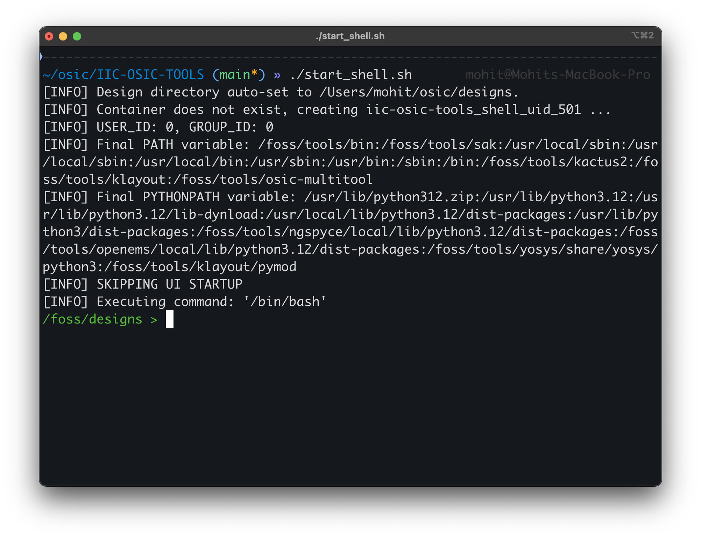
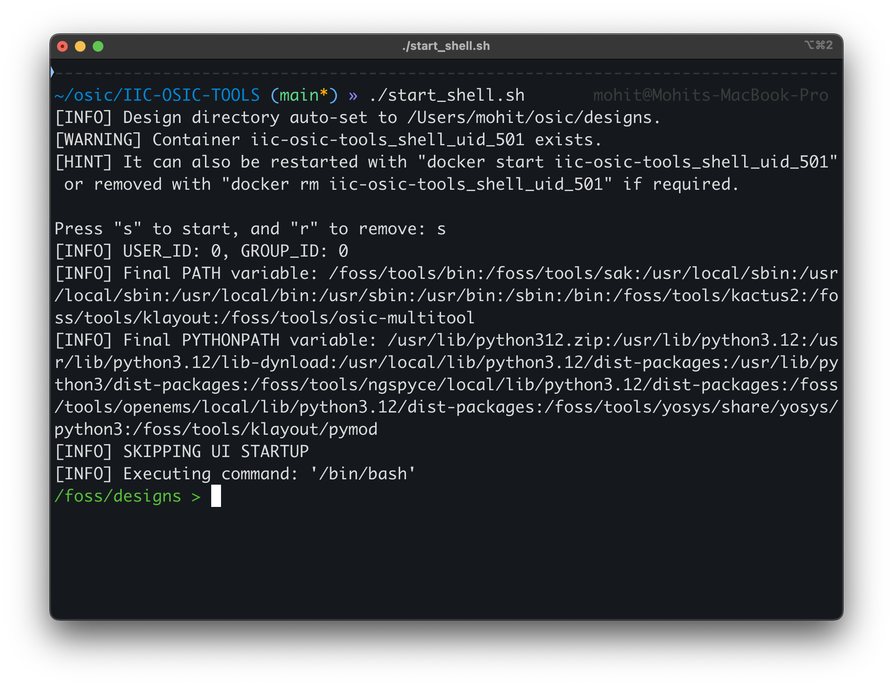

+++
title = "inaugural workshop"
date = 2026-01-24
+++

## initial setup
Create a project directory to contain all the relevant respositories and project sub-directories.
```bash
mkdir ~/osic && cd ~/osic
```
Now, clone the [github repository](https://github.com/iic-jku/IIC-OSIC-TOOLS) required for the IIC-OSIC-TOOLS docker image.
```bash
git clone --depth=1 https://github.com/iic-jku/iic-osic-tools.git
```
From here, the steps slightly diverge depending on what platform you are using.


### macOS
Install the relevant Docker Desktop depending on your architecture (Intel / Silicon) from their [webpage](https://www.docker.com/products/docker-desktop/) and configure your account.

Now, back in the terminal, return to the directory where the IIC-OSIC-TOOLS repo is cloned to edit the startup scripts (start_x.sh, start_vnc.sh, start_shell.sh). We need to change the $DESIGN environment variable to set the directory that holds the design files. In this case, we will set it as $HOME/osic/designs.
```bash,hl_lines=2
if [ -z ${DESIGNS+z} ]; then
	DESIGNS=$HOME/eda/designs # replace this with $HOME/osic/design
	if [ ! -d "$DESIGNS" ]; then
		${ECHO_IF_DRY_RUN} mkdir -p "$DESIGNS"
	fi
	[ -z "${IIC_OSIC_TOOLS_QUIET}" ] && echo "[INFO] Design directory
    auto-set to $DESIGNS."
fi
```
As we just saw, there are three modes of running the docker image, conveniently wrapped in scripts for us:
1. start_vnc.sh is for the VNC mode of operation, which provides an XFCE desktop environment in the noVNC server integrated in your browser (not preferred, very clunky)
2. start_shell.sh is for full root access without a graphical interface. This mode unfortunately cannot run GUI applications such as OpenROAD and KLayout, for instance.
3. start_x.sh is for the X11 mode of operation, which runs on the local X11 server, enabling you to run GUI applications. For macOS, this requires installation of XQuartz, the X11 server for macOS and some setup for port forwarding the docker container as follows:

After installing XQuartz from the [website](https://www.xquartz.org/) / homebrew formula, open the app and navigate to the Settings window (Cmd + ,) > Security and enable the "Allow connections from network clients" setting.


Then, enter the following command in the XQuartz terminal to allow network connections
```bash
xhost + 127.0.0.1
```
Note that it is normal for the XQuartz terminal to look slightly broken if you are using custom themes (Oh-My-Zsh, etc.). You can close the XQuartz application, the relevant script will launch it automatically. 

Back in the macOS terminal, execute
```bash
 ./start_<mode>.sh
```
where `<mode>` = [shell, x, vnc] is replaced with the desired mode of operation of the image. Upon first execution, also conveniently pulls the docker image located at hpretl/iic-osic-tools. Please wait as this can take very long (10-20 minutes, depending on your internet connection and luck), and once done it creates the container if it doesn't exist.

In regular usage, it prompts you asking you if you want to start/remove it, and choose to start it. Note that removing the container deletes any configuration you may have done on it due to its ephemerality, so **refrain** from removing it unless you know what you are doing.


Et voilà! You can now use the vast assortment of tools that IIC-OSIC-TOOLS makes available, such as