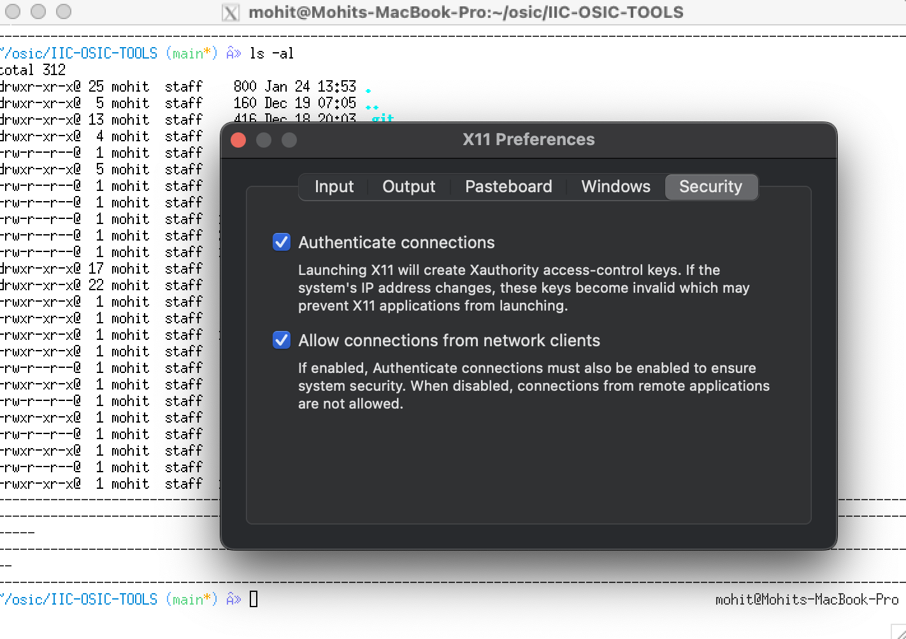

+++
title = "inaugural workshop prerequisites"
date = 2026-01-24
+++

## what to bring
Please bring a laptop with:
- 4GB of RAM (16 recommended)
- 15GB of free disk space prior to installation (20 recommended)
- the following installation of IIC-OSIC-TOOLS docker image and repository with configuration relevant to your OS.

Please note that at the event network speeds are not guaranteed to be good so it is strongly recommended to come with everything locally installed. If you have any problems with configuration please reach out to [kontaktrho@gmail.com](kontaktrho@gmail.com) or send a message in our [discord server](https://discord.gg/kDBPrpqW). 

## initial setup 
(click to enlarge images)

Create a project directory to contain all the relevant respositories and project sub-directories.
```bash
mkdir ~/osic && cd ~/osic
```
Now, clone the [github repository](https://github.com/iic-jku/IIC-OSIC-TOOLS) required for the IIC-OSIC-TOOLS docker image.
```bash
git clone --depth=1 https://github.com/iic-jku/iic-osic-tools.git
```
### installing Docker
- **macOS**: Install Docker Desktop for your architecture (Intel / Silicon) from their [webpage](https://www.docker.com/products/docker-desktop/) and configure your account.

- **Linux**: Install Docker Engine using the [official documentation](https://docs.docker.com/engine/install/) for your distribution. Make sure your user is in the `docker` group so you can run containers without `sudo`:
```bash
sudo usermod -aG docker $USER
```
Log out and back in for the group change to take effect. (Untested on Wayland, but should probably work.)
- **Windows**: I would strongly suggest against using Windows due to the sheer amount of config and potential troubleshooting required. But if you're up for it, you can refer to this [installation guide](https://kwantaekim.github.io/2024/05/25/OSE-Docker/#in--windows) which provides detailed steps for configuring WSL2, MobaXTerm, and other tools required to perform the installation.

### configuring the startup scripts
We need to tell the startup scripts where our design files will live. Open each of the three scripts (**start_x.sh**, **start_vnc.sh**, **start_shell.sh**) in the cloned repo and find this line:
```bash
DESIGNS=$HOME/eda/designs
```
Replace it with:
```bash
DESIGNS=$HOME/osic/designs
```

There are three modes of running the docker image, conveniently wrapped in scripts for us:
1. **start_vnc.sh** is for the VNC mode of operation, which provides an XFCE desktop environment in the noVNC server integrated in your browser (not preferred, very clunky)
2. **start_shell.sh** is for full root access without a graphical interface. This mode unfortunately cannot run GUI applications such as OpenROAD and KLayout, for instance.
3. **start_x.sh (recommended)** is for the X11 mode of operation, which runs on the local X11 server, enabling you to run GUI applications. **This is the mode we will be using for the workshop.**

### macOS only: X11 port forwarding with XQuartz

On macOS, X11 is not available natively so we need **XQuartz**. Linux users can skip ahead to [running the container](#running-the-container).

After installing XQuartz from the [website](https://www.xquartz.org/) / homebrew formula, open the app and navigate to **Settings window (Cmd + ,) > Security** and enable the **"Allow connections from network clients"** setting.


Then, enter the following command in the XQuartz terminal to allow network connections:
```bash
xhost + 127.0.0.1
```
Note that it is normal for the XQuartz terminal to look slightly broken if you are using custom themes (Oh-My-Zsh, etc.). You can close the XQuartz application, the relevant script will launch it automatically.

### running the container
Execute:
```bash
./start_x.sh
```
Upon first execution, the script pulls the docker image located at hpretl/iic-osic-tools. **Please wait as this can take a while** (10-20 minutes, depending on your internet connection and luck), and once done it creates the container if it doesn't exist.

In regular usage, it prompts you asking you if you want to start/remove it, and choose to start it. Note that removing the container deletes any configuration you may have done on it due to its ephemerality, so **refrain** from removing it unless you know what you are doing.


Et voilà! You can now use the vast assortment of tools that IIC-OSIC-TOOLS makes available, such as OpenROAD, Librelane, KLayout, Magic, among others.

## installing OpenROAD
For this demo, we will be using OpenROAD and exploring the OpenROAD Flow Scripts (ORFS) automated design flow. We clone the ORFS repo and checkout to a stable tested version.
```bash
cd ~/osic/designs
git clone https://github.com/The-OpenROAD-Project/OpenROAD-flow-scripts.git && cd OpenROAD-flow-scripts
git checkout $(cat $TOOLS/openroad-latest/ORFS_COMMIT)
```
In order to use OpenROAD with IIC-OSIC-TOOLS, we need to set a few environment variables **in the container** (not your system terminal). After starting the container (preferably in X11 mode, from now on) add this to the **.bashrc** config file (found at $HOME/.bashrc):
```bash
export YOSYS_EXE=$TOOLS/yosys/bin/yosys
export OPENROAD_EXE=$TOOLS/openroad/bin/openroad
export OPENSTA_EXE=$TOOLS/openroad/bin/opensta
```
To quickly check if your installation is working, go back to the git repository and run a smoke test using the default design, cd into the flow directory and run make.
```bash
cd ~/osic/designs/OpenROAD-flow-scripts/flow/
make
``` 
To clean up after just run
```bash
make clean_all
```

and you're good to go (for now ;))
